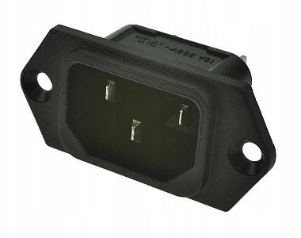

# Modification of Mikrotik CRS326-24G-2S+RM Switch.
## Installing the internal power supply and fan.

> [!WARNING]
> Work with voltages up to 230V requires appropriate qualifications and experience.
> The following study is only a documentation of the work on the above topic.

  CPU temperature as a result of modification 69 -> **33** stopni Celcjiusza.

### Materials used:

- Power Connector Inlet AC IEC C14 IBM (Schurter 6100.3300)

- Mounting screws with M3 nuts, length around 6mm (M3x6mm) conical or flat.

- Schottky diode case SMB or SMA: B340LB-13-F (SMB), **SS34A** (SMA):

  Forward current: 3A, Reverse voltage: 40V, Case: DO214AC (SMA) or DO-214AA (SMB)

  [Datasheet  B340LB ](/images/B340LA_B.pdf), [Datasheet SS34](/images/ss32.pdf)

- Fan 4020 24V DC (wymiary: 40mm x 40mm x 20mm): Sunon MF40202V2-1000U-A99
  
  [Fan Datasheet](/images/Sunon_MF40202V2_1000U_A99D04115160G_010-3078676.pdf)

- Mounting screws: M3x25mm with nuts or screws for the fan (required to drill holes in the switch housing up to 5mm)
- Switching Power Supply 24V DC: Mean Well LRS-50-24 24V 2.2A 52.8W
  
  [PS Datasheet](/images/LRS-50-SPEC.PDF)

  [Scaled dimension mask](/images/lrs50-dimensions.pdf) for measuring the mounting holes (print with 100% size).

### Etapy prac:

1. Making mounting holes for the power supply.
    Print the mask with the dimensions of the power supply, locate and mark the place of drilling the mounting holes (arrows on the printout).

      The distance between the holes is 55mm.
     
3. Knock out the mask of the power socket.
4. Widen the fan mounting holes (only if using 5mm fan mounting screws).
5. Clean the metal shavings off the housing.
6. Prepare marked places for soldering. Clean the IPA and flux it.

    
7. Solder the Schottky diode at D6 in the same direction as D1.

    
8. Solder the DC power wires. Measure the length to the power supply about 220mm.
9. Clean off flux residues with IPA.
10. Secure the DC power cables. Hot glue and heat shrink tube (optional).

    

11. Prepare an AC outlet. Solder and secure the wires.

12. Install and secure the AC inlet.

13. Install the power supply.

    **WARNING!** Mounting screws must not be longer than **3mm** on the mounting side of the power supply.
    
16. Connect the AC power cables and ground.

    

    In the photo, the ground wire (GND) is blue, it should be yellow-green.

17. Install the fan, outlet outside the housing.
18. Connect-screw the DC power cables of the switch and the fan.

    

19. Modify the vents as shown in the picture below.   

    